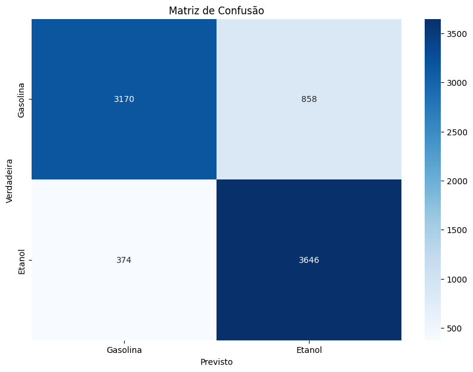
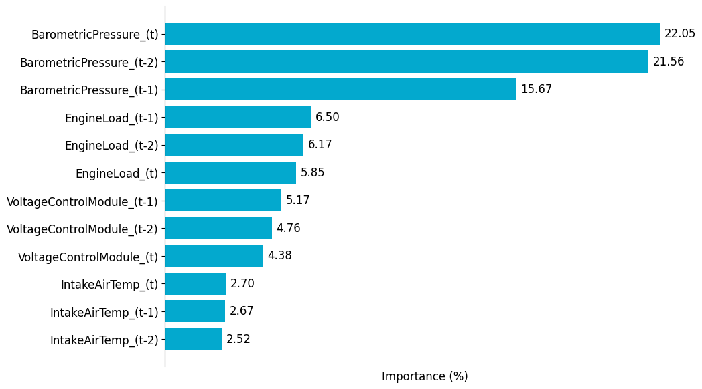

<p align="center">
  
</p> 

# Classificação de Combustível

A classificação do tipo de combustível através da coleta de dados dos sensores veiculares, com o auxílio do Tiny Machine Learning (TinyML), é um passo importante na redução das emissões de carbono e na promoção da sustentabilidade no setor automotivo. Ao identificar o tipo de combustível utilizado por um veículo, seja gasolina ou etanol, por exemplo, os sistemas de gestão de emissões podem calcular com maior exatidão a quantidade de carbono liberada durante o seu uso. Isso não apenas permite uma avaliação mais precisa do impacto ambiental de cada veículo, mas também possibilita a implementação de políticas e incentivos para veículos mais limpos e eficientes. Com o TinyML, essa classificação pode ser realizada de forma eficiente, em tempo real e na borda da rede, contribuindo para uma gestão mais eficaz das emissões veiculares e para a promoção de uma mobilidade sustentável.

## Como executar

A execução deste projeto se dá em duas etapas. A primeira refere-se a coleta dos dados, o treinamento do modelo de aprendizado de máquina e a sua geração no formato a ser embarcado no hardware. A segunda parte refere-se a incorporação em si.

### Treinamento e geração do modelo em C++

Para realizar o treinamento e a geração do modelo em C++, coloque o arquivo [notebook](./ClassificadorDeCombustivel.ipynb) na sua conta do [Google Colab](https://colab.google/) e execcute-o. 

O notebook irá gerar um arquivo chamado `classifier.h`. Coloque este arquivo na pasta `./Freematics/firmware_v5/telelogger`

OBS.: Por questões de proteção dos dados, não será disponibilizado os dados utilizados para realizar o treinamento deste modelo. Contudo, o artefato do modelo já se encontra dentro da pasta a ser incorporada no Freematics One+.

### Freematics

1 - Instale o [Visual Studio Code](https://code.visualstudio.com/)

2 - Installe o [PlatformIO](https://platformio.org/) (Extensão do VSCode)

3 - Clone este repositório

```bash
git clone https://github.com/conect2ai/fuel-classification-CBA2024.git
```

4 - Abra a pasta do projeto `./Freematics/firmware_v5/telelogger` no PlatformIO, como ilustrado na figura abaixo.

<p align="center">
  
</p> 

5 - Conecte o Freematics One+ ao computador e ligue-o com o Freematics Emulator ou no veículo.

6 - Compile, faça o upload e monitore o serial (etapas 1, 2 e 3, respectivamente na figura abaixo).

<p align="center">
  
</p> 


## Resultados do estudo de caso

Para avaliar o resultado da classificação, foram utilizadas a matriz de confusão e o reatório da classificação da biblioteca scikit-learn, o qual calcula a acurácia, recall, precisão e F1-score. Os códigos utilizados para gerar os gráficos abaixo encontram-se no arquivo [notebook.ipynb](./Analysis/notebook.ipynb)

A figura abaixo ilustra a matriz de confusão obtida.

<div style="text-align:center">
    
</div>

A tabela abaixo contém os valores das métricas obtidos a partir do Relatório da Classificação.

|             | Precisão  | Recall | F1-Score | Amostras|
|-------------|-----------|--------|----------|---------|
| 0           | 0.89      | 0.79   | 0.84     | 4028    |
| 1           | 0.81      | 0.88   | 0.86     | 4028    |
| **Accuracy**|           |        | **0.85**| **8048**|
| **Macro Avg** | 0.85      | 0.85   | 0.85     | 8048    |
| **Weighted Avg** | 0.85   | 0.85   | 0.85     | 8048    |

A figura ilustrada abaixo, é possível observar a importância das variáveis para o modelo treinado.

<div style="text-align:center">
    
</div>