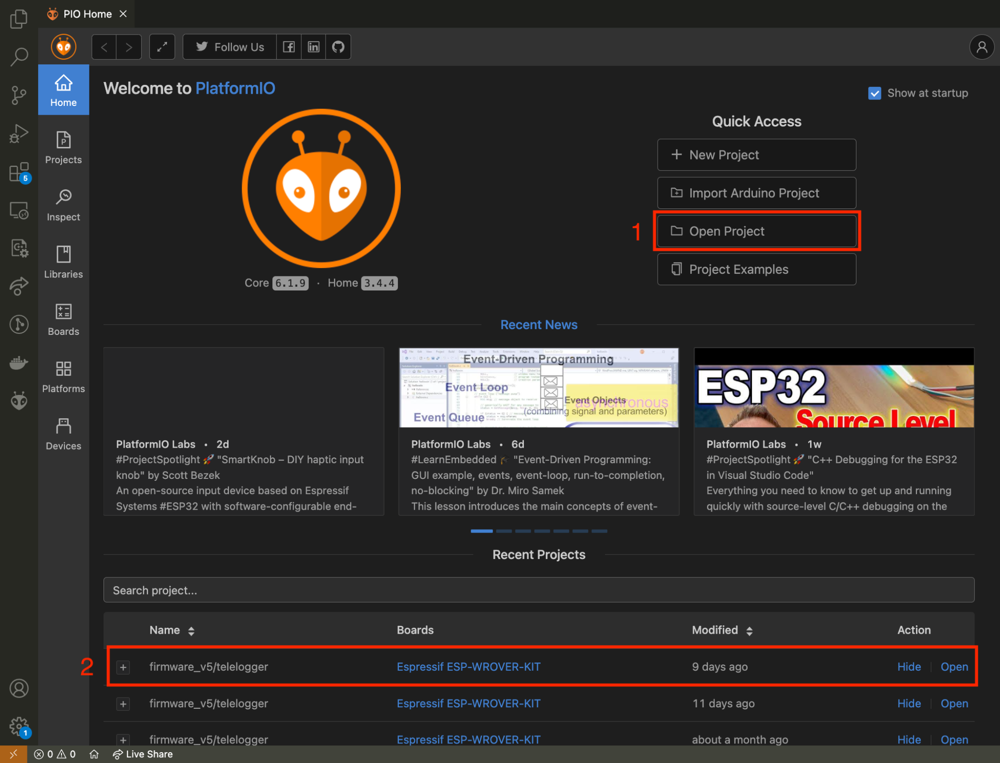

<p align="center">
  
</p> 

# Fuel Classification

Classifying the type of fuel through data collection from vehicle sensors, with the aid of Tiny Machine Learning (TinyML), is an important step in reducing carbon emissions and promoting sustainability in the automotive sector. By identifying the type of fuel used by a vehicle, whether gasoline or ethanol, for example, emission management systems can more accurately calculate the amount of carbon released during its use. This not only allows for a more precise assessment of the environmental impact of each vehicle but also enables the implementation of policies and incentives for cleaner and more efficient vehicles. With TinyML, this classification can be performed efficiently, in real-time, and at the edge of the network, contributing to more effective vehicle emission management and promoting sustainable mobility.

## How to run

The execution of this project is done in two stages. The first refers to data collection, machine learning model training, and its generation in the format to be embedded in the hardware. The second part refers to the incorporation itself.

### Training and generating the model in C++

To perform the training and generation of the model in C++, upload the [notebook](./FuelClassificationModel.ipynb) to your [Google Colab](https://colab.google/) account and execute it.

The notebook will generate a file called `classifier.h`. Place this file in the `./Freematics/firmware_v5/telelogger` folder.

Note: For data protection reasons, the data used to train this model will not be provided. However, the model artifact is already included in the folder to be incorporated into the Freematics One+.

### Freematics

1. Install [Visual Studio Code](https://code.visualstudio.com/)
2. Install [PlatformIO](https://platformio.org/) (VSCode Extension)
3. Clone this repository:

```bash
git clone hhttps://github.com/conect2ai/fuel-classification-SIoT2024.git
```

4. Open the project folder `./Freematics/firmware_v5/telelogger` on PlatformIO, as illustrated in the figure below.

<p align="center">
  
</p> 

5. Connect the Freematics One+ to your computer and turn it on using the Freematics Emulator or in the vehicle.

6. Compile, upload and monitor the serial (steps 1, 2 and 3, respectively in the figure below).

<p align="center">
  
</p> 

## Results of the case study

To evaluate the pruned model in C++, the file [main.cpp](./Analysis/main.cpp) was used to load the model and generate the inferences in a csv file. This file was then loaded into a Jupyter notebook to generate the evaluation metrics. Among the metrics used, the confusion matrix and the scikit-learn classification report were used, which calculate accuracy, recall, precision, and F1-score. The codes used to generate the graphs below are in the file [process_csv.ipynb](./Analysis/process_csv.ipynb).

The figure below illustrates the obtained confusion matrix.

<div style="text-align:center">
 
</div>

The table below contains the metric values obtained from the Classification Report.

|             | Precision | Recall | F1-Score | Samples |
|-------------|-----------|--------|----------|---------|
| Gasoline    | 0.76      | 0.99   | 0.86     | 9240    |
| Ethanol     | 0.98      | 0.70   | 0.81     | 9240    |
| Accuracy|           |        | 0.84 | 9240|
| Macro Avg | 0.87    | 0.84   | 0.84     | 18480    |
| Weighted Avg | 0.87 | 0.84   | 0.84     | 18480     |

In the figure illustrated below, you can observe the importance of the variables for the trained model.

<div style="text-align:center">
 
</div>

## License

This project is licensed under the MIT License - see the [LICENSE](LICENSE) file for details.

# About us

The research group [**Conect2AI**](http://conect2ai.dca.ufrn.br) consists of undergraduate and graduate students from the Federal University of Rio Grande do Norte (UFRN) and aims to apply Artificial Intelligence (AI) and machine learning in emerging fields. Our expertise includes Embedded Intelligence and IoT, optimizing resource management and energy efficiency, contributing to sustainable cities. In energy transition and mobility, we apply AI to optimize energy use in connected vehicles and promote more sustainable mobility.
